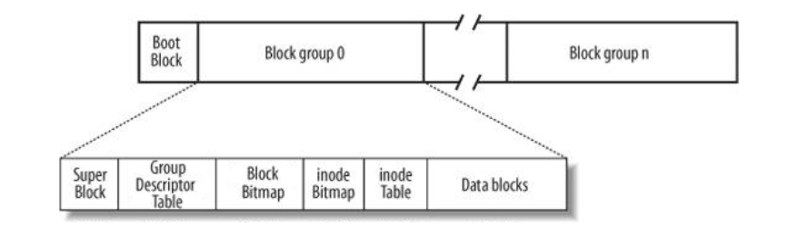

# EXT2文件系统

## 整体布局

0. 文件系统中存储的最小单位是块（Block），一个块的大小在格式化时确定，可以为1k、2k、4k等。
1. 第一个块为启动块，固定大小为1k，忽略不用。
2. 超级块：描述了整个文件系统的基本信息，在每个块组前都有一份拷贝。（注：ext2的第一个修订版本在每个块组前拷贝超级块，但是之后的版本为了减少冗余，只在特定的块组前保存超级块。特定的块组为0、1和3、5、7的乘方。）
3. 块组描述符表：由很多块组描述符组成，文件系统中有多少块组就有多少块组描述符，块组描述符表在每个块组前也有一份拷贝。
4. 块位图：用于描述整个块组中哪些块已用，它本身占一个块，每个bit表示一个块，1为已用，0为空闲。
5. inode位图：描述哪些inode可用。
6. inode表：描述一个文件的基本信息。
7. 数据块：
   1. 常规文件的数据保存在数据块中。
   2. 对于目录，该目录下的所有文件名和子目录储存在数据块中。
   3. 对于符号链接，如果目标路径较短则直接保存在inode中，若目标路径较长则分配一个数据块保存。
   4. 设备文件、FIFO和socket等特殊文件没有数据块。
